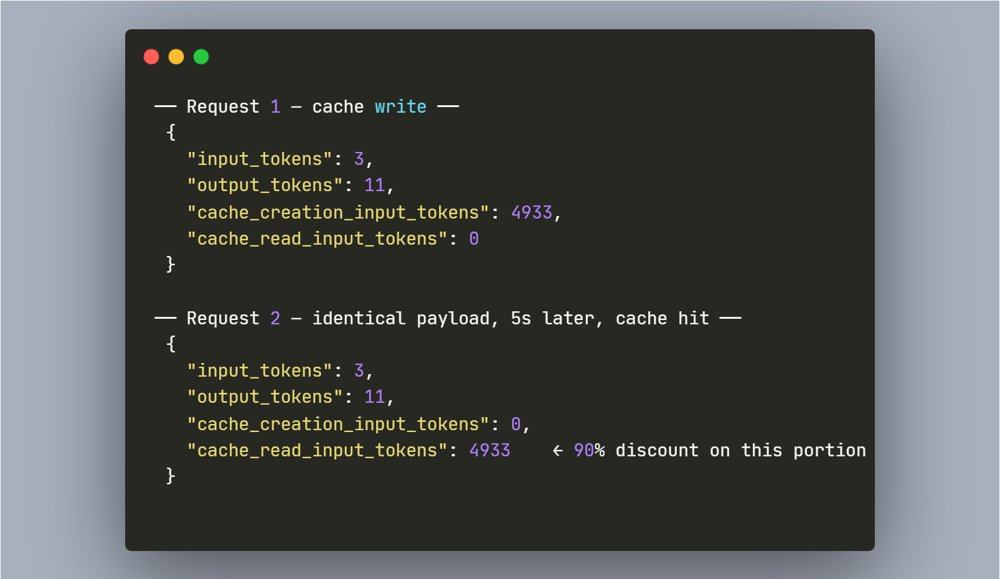

# ModelMeld

> Per-request capability routing for Claude Code, Cursor, Aider, Cline,
> Continue. Speaks OpenAI and Anthropic natively. Bring your own key —
> never stored.

[](LICENSE)
[](pyproject.toml)
[](https://pypi.org/project/modelmeld/)
[](https://github.com/modelmeld/modelmeld/actions/workflows/ci.yml)

## Quickstart

```bash
pip install modelmeld
modelmeld setup --tool claude-code
```

The setup CLI prompts for your ModelMeld API key (and optionally an
Anthropic key for BYOK frontier routing), writes a sourceable shell
script, pre-configures Claude Code's `/model` picker with the three
ModelMeld policies, and smoke-tests the routing pipeline before
declaring success.

Then in your shell:

```bash
source ~/.modelmeld/setup-claude-code.sh
claude
```

In the Claude Code TUI, type `/model` → pick `ModelMeld — Auto` (or
`Saver` / `Quality`). That's it. Self-hosting? See [Self-host](#self-host) below.

## Anthropic prompt caching, end-to-end

Anthropic prompt caching survives end-to-end through ModelMeld:



Same payload sent twice, seconds apart. The second call hits Anthropic's
prompt cache for **4933 tokens at 10% of normal rate** — a 90% input-token
discount, preserved through the gateway. Many other gateways strip
`cache_control` markers; ModelMeld passes them through verbatim.

## Why ModelMeld

You're paying frontier-model prices on every request — including the
ones where a coding-tuned 7B model would produce identical output. Most
gateways force a global choice ("use Anthropic" / "use OpenAI" / "use
local"). ModelMeld picks per request, driven by a benchmark-weighted
capability scout that knows which model class is sufficient for which
task category.

## How it compares

| Capability | ModelMeld | Typical gateway |
|---|---|---|
| Anthropic `cache_control` preserved end-to-end | ✅ | ⚠️ Many strip it |
| Speaks `/v1/chat/completions` AND `/v1/messages` natively | ✅ | Usually OpenAI shape only |
| Audit headers expose the routing decision to the caller | ✅ (`x-modelmeld-routed-to`, `x-modelmeld-routed-model`, etc.) | Usually opaque |
| BYOK — keys never stored at rest | ✅ | Varies |
| Honest non-coverage list (what doesn't work yet) | ✅ | Rare |

The differentiator isn't that we route. It's that **we don't break the
features upstream providers built into their APIs**, and we tell you
exactly what the gateway did with your request.

## Three policies, three behaviors

Pick the policy that matches your work mode. They show up in any tool's
`/model` picker as three options:

- **`anthropic/modelmeld-saver`** — OSS-only. Never escalates to
  frontier. Predictable cost ceiling — you pay OSS-tier rates
  regardless of request complexity.
- **`anthropic/modelmeld-auto`** — OSS by default; escalates to
  frontier (Sonnet/Opus) when the prompt contains 2+ reasoning markers
  ("think step by step", "explain your reasoning", etc.).
- **`anthropic/modelmeld-quality`** — Frontier-first. Downgrades to OSS
  only on detected trivial work (autocomplete-shape, background calls).

**Frontier-tier routing uses BYOK.** Your Anthropic / OpenAI key is sent
as a per-request header (`x-modelmeld-byok-anthropic: sk-ant-…`), used
to make the upstream call, then forgotten. Never stored at rest, never
logged.

## Works with

Drop-in for any tool that speaks OpenAI Chat Completions or Anthropic
Messages.

**Validated end-to-end:**
[Claude Code](docs/integrations/claude-code.md) ·
[opencode](docs/integrations/opencode.md) ·
[Aider](docs/integrations/aider.md) ·
[AutoGen](docs/integrations/autogen.md) ·
[CrewAI](docs/integrations/crewai.md) ·
[LangGraph](docs/integrations/langgraph.md) ·
[OpenClaw](docs/integrations/openclaw.md) ·
OpenAI SDK · `anthropic-sdk-python` · `@anthropic-ai/sdk`

**Should work, not yet live-tested:**
[Cursor](docs/integrations/cursor.md) ·
[Cline](docs/integrations/cline.md) ·
[Continue](docs/integrations/continue.md) ·
Codex CLI

Frameworks can declare task category + agent role explicitly via
`x-modelmeld-task-category` / `x-modelmeld-agent-role` headers — bypasses
the classifier when your harness already knows what kind of work the
request represents. See [routing hints](docs/routing-hints.md).

## What doesn't work yet

Honest non-coverage list for the v1 OSS API surface:

- **OpenAI Responses API** (`/v1/responses`) — on the roadmap, not v1.
  Current Codex CLI still uses `/v1/chat/completions` and works
  through ModelMeld today; the newer Responses surface is the path
  for clients adopting OpenAI's stateful agent loop.
- **Anthropic image content blocks** (vision input) — deferred. Claude
  Code doesn't use vision; documented as a known gap rather than
  silently failing.
- **Streaming `cache_control` stats** — non-streaming responses surface
  `cache_creation_input_tokens` / `cache_read_input_tokens` correctly
  (see the screenshot above). The streaming-translation pipeline
  doesn't yet propagate the upstream `message_start` event's cache
  counts; tracked.

## What's in the package

- **Two API surfaces, one routing pipeline.** OpenAI-compatible at
  `/v1/chat/completions` (drop-in for any OpenAI-wire-format client).
  Anthropic-compatible at `/v1/messages` (drop-in for Claude Code,
  `anthropic-sdk-python`, `@anthropic-ai/sdk`). Both surfaces stream
  via SSE, share the same router / memory / cache pipeline, and emit
  identical `x-modelmeld-*` audit headers.
- **Provider adapters** — OpenAI, Anthropic (with full schema
  translation in both directions), vLLM, TensorRT-LLM. Each adapter
  retries transient errors (429 / 5xx / network blip) with exponential
  backoff.
- **Capability-based routing** — `CapabilityScout` picks the cheapest
  model meeting a quality threshold for the prompt's task category,
  driven by the `ModelRegistry`.
- **Completion cache** — exact-match (in-memory or Redis) + semantic
  (Qdrant); cache key pools across users routed to the same served model.
- **PII scrubbing** — runs on every egress path before cloud upload.
- **Production-tuned defaults** — full dev-tool detection catalog and a
  current `default_registry.json` snapshot ship as the defaults. All
  tunable via constructor args.

## Self-host

`modelmeld setup` configures your tool against the hosted gateway at
`api.modelmeld.ai`. To run the gateway yourself instead:

```bash
pip install 'modelmeld[anthropic,openai]'
export ANTHROPIC_API_KEY=sk-ant-…   # your real Anthropic key
export OPENAI_API_KEY=sk-…           # your real OpenAI key (optional)
uvicorn modelmeld.api.server:app --host 0.0.0.0 --port 8080
```

Then point your tool at `http://localhost:8080`. Behavior is identical
to the hosted endpoint; you supply upstream keys via env vars instead
of BYOK headers.

For routing across local vLLM + cloud providers, see
[`docs/backends.md`](docs/backends.md). For full self-host operational
notes (TLS, scaling, observability), see [`docs/self-host.md`](docs/self-host.md).

## Licensing — TL;DR

- **Code: AGPL-3.0-or-later.** Use, modify, redistribute. Calling the
  gateway over HTTP from unmodified clients (Cursor, Aider, Claude
  Code, etc.) does NOT make those clients AGPL. Running a modified
  gateway as a service for third parties does require your
  modifications to also be AGPL.
- **Bundled snapshot data** (`scout/data/default_registry.json`):
  CC-BY-4.0 with attribution. Use the snapshot scores anywhere.
- **Live curated registry feed** (`feed.modelmeld.ai`): subscription
  product. Continuously updated, editorially weighted across multiple
  benchmark sources.

If you `pip install modelmeld` and never subscribe, **everything works** —
you just route on a snapshot of benchmark data taken at OSS release date.
Over ~6 months that snapshot stales relative to the current best-cost
frontier; the feed is what keeps routing decisions sharp.

Full rationale, boundary contract, and commercial-licensing options:
[`docs/license-rationale.md`](docs/license-rationale.md),
[`docs/open-core-boundary.md`](docs/open-core-boundary.md),
[`docs/registry-feed.md`](docs/registry-feed.md). Or email
`hello@modelmeld.ai`.

## Status

Production-ready for the routes documented here. Pre-1.0 on SemVer
guarantees for the public Python API — see
[`docs/api-stability.md`](docs/api-stability.md) for which symbols
carry compatibility commitments and which are subject to change.

The HTTP surfaces (`/v1/chat/completions`, `/v1/messages`, the
`x-modelmeld-*` audit headers) are stable in spirit; we won't break
existing integrations without a major-version bump and a deprecation
window.

## Contributing

PRs welcome. See [`CONTRIBUTING.md`](CONTRIBUTING.md) for the dev
workflow, code style (`ruff format` + `ruff check` + `pyright`), and
DCO commit-signoff requirement. Issues labeled `good first issue` are
intentionally scoped for first-time contributors.

We do **not** accept PRs that modify the bundled snapshot data files
(`scout/data/`) — those are curated centrally for the live feed. File
issues against bad routing decisions you observe and we'll evaluate
adjustments for the next feed release.

## Community

- **GitHub Issues** — bugs + feature requests (after reading [`CONTRIBUTING.md`](CONTRIBUTING.md))
- **GitHub Discussions** — questions, ideas, integration help
- **Security** — see [`SECURITY.md`](SECURITY.md); report to `security@modelmeld.ai` (90-day disclosure window)

## Enterprise tier

For production deployments needing API-key auth, RBAC, OIDC SSO,
Postgres-backed SOC2-grade audit logs, encryption-at-rest, per-tenant
rate limiting, FinOps dashboards, multi-tenant Qdrant cache, or the
managed hosted tier — email `hello@modelmeld.ai`.

## License

- Code: AGPL-3.0-or-later (see [LICENSE](LICENSE), [NOTICE](NOTICE), [`docs/license-rationale.md`](docs/license-rationale.md))
- Data files: CC-BY-4.0 (see [scout/data/LICENSE.md](src/modelmeld/scout/data/LICENSE.md))
- Live feed: subscription terms (see [NOTICE](NOTICE) and [`docs/registry-feed.md`](docs/registry-feed.md))
